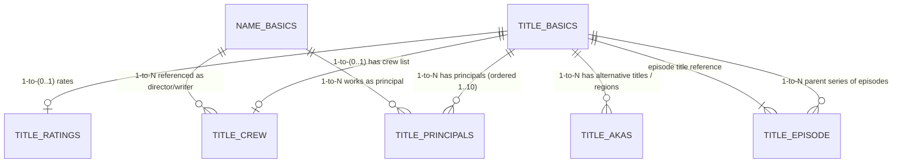

# IMDb Relational Schema & Join Architecture

This document maps all entity relationships across the seven IMDb dataset files, analyzes join cardinalities, highlights row multiplication risks, and defines safe merging strategies for analytical datasets.

---

## 1. Entity Relationship Diagram (ERD)



---

## 2. Primary Identifiers & Foreign Key Keys

### Core Entities
1. **Title Identifier (`tconst`)**:
   - Format: `tt` + 7-8 digits (e.g., `tt0076759` for *Star Wars*).
   - Primary Key in: `title.basics.tsv`, `title.ratings.tsv`, `title.crew.tsv`, `title.episode.tsv`.
   - Foreign Key in: `title.principals.tsv`, `title.akas.tsv` (as `titleId`), `title.episode.tsv` (as `parentTconst`).

2. **Person Identifier (`nconst`)**:
   - Format: `nm` + 7-8 digits (e.g., `nm0000204` for *George Lucas*).
   - Primary Key in: `name.basics.tsv`.
   - Foreign Key in: `title.principals.tsv`, `title.crew.tsv` (comma-separated list in `directors` and `writers`).

---

## 3. Relationship Cardinalities & Join Impact Analysis

| Foreign Key Join | Source Table | Target Table | Cardinality | Join Safety Level | Row Multiplication Risk & Behavior |
|---|---|---|---|---|---|
| `tconst` | `title.basics` | `title.ratings` | **1-to-(0..1)** | **SAFE** | **Zero Row Explosion**. Each title has at most 1 rating entry. Unrated titles result in NULLs during LEFT JOIN. |
| `tconst` | `title.basics` | `title.crew` | **1-to-(0..1)** | **SAFE** | **Zero Row Explosion**. Each title has at most 1 crew entry containing comma-separated lists of `directors` and `writers`. |
| `tconst` | `title.basics` | `title.principals` | **1-to-N (1..10)** | **HIGH RISK** | **Row Explosion (Up to 10x)**. Joining expands 1 title row into up to 10 rows for actors, directors, writers, etc. Aggregation required before title-level analysis. |
| `tconst` / `titleId` | `title.basics` | `title.akas` | **1-to-N (1..50+)** | **EXTREME RISK** | **Massive Row Explosion (Up to 50x+)**. Regional releases multiply titles into dozens of localized names. Must filter to specific `region` (e.g. `US`) or `isOriginalTitle=1` first. |
| `parentTconst` | `title.basics` | `title.episode` | **1-to-N (1..1,000+)** | **HIGH RISK** | **Series Hierarchy**. One TV series `tconst` links to hundreds or thousands of episode `tconst` rows. |
| `nconst` | `title.principals` | `name.basics` | **N-to-1** | **SAFE after filter** | Maps person names and metadata to principal role rows. |

---

## 4. Safe Analytical Table Construction Strategies

### Strategy A: Safe Title-Level Analytical Table (Recommended Core)
To create a clean, single-row-per-title analytical dataset for visualization (e.g. in Tableau or D3):

```sql
SELECT 
    b.tconst,
    b.titleType,
    b.primaryTitle,
    b.isAdult,
    CAST(b.startYear AS INT) AS startYear,
    CAST(b.runtimeMinutes AS INT) AS runtimeMinutes,
    b.genres,
    r.averageRating,
    r.numVotes,
    c.directors,
    c.writers
FROM title_basics b
LEFT JOIN title_ratings r ON b.tconst = r.tconst
LEFT JOIN title_crew c ON b.tconst = c.tconst
WHERE b.isAdult = '0';
```

> [!TIP]
> **Why this join is safe**: Since `title.ratings` and `title.crew` both share `tconst` as a unique primary key, a `LEFT JOIN` preserves exact title row count without duplicating any rows.

---

### Strategy B: Granular Star/Network Relational Table (Optional Extension)
If the project research question explores director-actor collaborations or career trajectories:
1. First filter titles by minimum vote count (e.g., `numVotes >= 5000`) to isolate major titles (~35,000 titles out of 11M).
2. `JOIN title.principals ON tconst` to obtain cast roles.
3. `JOIN name.basics ON nconst` to attach actor/director names and birth years.

This avoids out-of-memory errors while preserving network topology.
